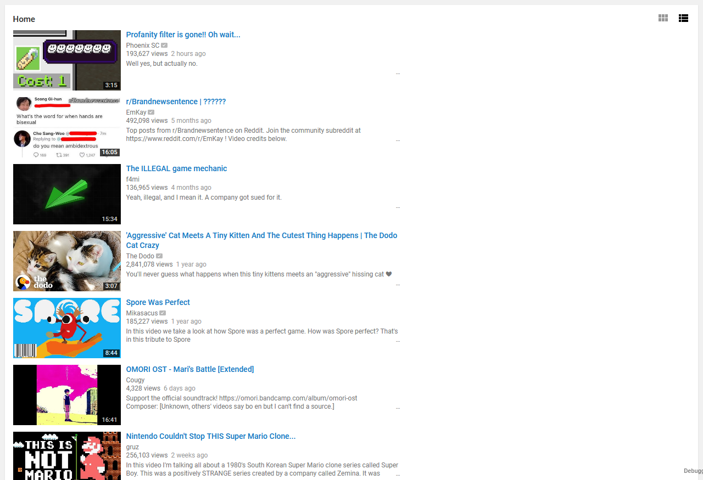

# Configuration
*(Note: This document and its assets should be removed when Rehike has a configuration GUI.)*

*(Note 2: This document will only detail the configuration of `exp-signin-rework`, as that is the main branch being worked on currently)*

Rehike has a `config.json` file located in the root directory of it, next to `index.php` and such. This document will detail what each configuration key in it does.

## What the `config.json` file looks like

<pre>
{
    "useRingoBranding": true,
    "uploadMenuType": "MENU",
    "dateOnWatchSidebarItems": false,
    "useWebV2HomeEndpoint": false,
    "versionInFooter": true,
    "useReturnYouTubeDislike": true,
    "enableRehikeDebugger": false,
    "largeSearchThumbs": true,
    "byTextOnByline": false,
    "noViewsText": false,
    "movingThumbnails": true,
    "guideOnWatchPage": false,
    "hhCSSFixes": true
}
</pre>

|Contents                                                 |
|---------------------------------------------------------|
| 1. [`useRingoBranding`](#useringobranding)              |
| 2. [`uploadMenuType`](#uploadmenutype)                  |
| 3. [`dateOnWatchSidebarItems`](#dateonwatchsidebaritems)|
| 4. [`useWebV2HomeEndpoint`](#usewebv2homeendpoint)      |
| 5. [`versionInFooter`](#versioninfooter)                |
| 6. [`useReturnYouTubeDislike`](#usereturnyoutubedislike)|
| 7. [`enableRehikeDebugger`](#enablerehikedebugger)      |
| 8. [`largeSearchThumbs`](#largesearchthumbs)            |
| 9. [`byTextOnByline`](#bytextonbyline)                  |
| 10. [`noViewsText`](#noviewstext)                       |
| 11. [`movingThumbnails`](#movingthumbnails)             |
| 12. [`guideOnWatchPage`](#guideonwatchpages)            |
| 13. [`HHCSSFixes`](#hhcssfixes)                         |

## `useRingoBranding`

Enables/disables the use of the current logo, and a bright red color.

`true`:

`false`:

## `uploadMenuType`

Sets the display of the "Upload" menu/button found in the top right of the page.

`"BUTTON"`:

`"ICON"`:

`"MENU"`:

*(Note: You can use any value that is not "BUTTON" or "ICON" for this, as it is the default and the fallback.)*

## `dateOnWatchSidebarItems`

Enables/disables showing relative date on the watch page's "Up next" section.

`true`:

`false`:

## `useWebV2HomeEndpoint`:

Enables/disables the homepage which uses the WEB V2 endpoint. This homepage has no shelves. Instead it is all one section. However, you gain the ability to view the videos in a list view.

`true`:

|Grid|List|
|----|----|
|||

`false`:

## `versionInFooter`

Shows the Rehike version in the footer, which links to the version page.

`true`:

`false`:

## `useReturnYouTubeDislike`

Enables/disables showing dislikes and sparkbar on watch page, using data from the [Return YouTube Dislike](https://returnyoutubedislike.com/) API.

`true`:

`false`:

## `enableRehikeDebugger`

Enables the Rehike debugger. Also useful if errors somehow get spat out into the document and fuck up your entire experience.

## `largeSearchThumbs`

Enables/disables large thumbnails on search.

`true`:

`false`:

## `byTextOnByline`

Enables/disables the showing of "by" before the author's name on videos.

`true`:

`false`:

## `noViewsText`

Enables/disables the hiding of the "views" text after the view count on the watch page.

`true`:

`false`:

## `movingThumbnails`

Enables/disables animated previews upon hovering over a video.

`true`:

`false`:

## `guideOnWatchPage`

Enables/disables guide pinning on the watch page.

`true`:

`false`:

## `hhCSSFixes`

Consistency/bug fixes for default Hitchhiker CSS. This may conflict with CSS themes, so set it to `false` if you encounter any issues with themes.
