# Automatic installation

Currently, there are no solutions to automatically install Rehike. **Rehike is still in active development, and should be considered "use at your own risk" at the moment.**

# Manual installation

Manual installation entails installing of the prerequisites in order to set up your own Rehike development environment.

Although Rehike has tried hard to maintain minimal dependencies, this may change in the future as the scope of the project broadens. For example, we may introduce additional technologies in order to compile certain source code.

## Prerequisites

**The current prerequisites in order to install Rehike are:**

- Windows 7 or later, or equivalences for other operating systems.
    - As nice as it would be to support a 21 year old operating system, unfortunately the PHP runtime itself has imposed this limit upon us.
        - That being said, you can use Rehike on older operating systems by hosting the server on a newer operating system, either on another computer or within a virtual machine.
- PHP 7 or greater
    - **For the layman, [XAMPP](https://www.apachefriends.org/index.html) is the preferred easy solution for Windows environments.**
        - [*Jump to the installation instructions*](#installing-xampp)
    - If you're using Linux, the default PHP distribution in your package manager may not come with all of the required extensions. Currently, we are aware that the [DOMDocument extension](https://www.php.net/manual/en/dom.setup.php) is not installed by default.
- A proxy to override YouTube's website
    - There is no one way to do this, but we have our personal recommendations for this.
    - For Windows users, we recommend using [**Fiddler Classic**](https://www.telerik.com/fiddler/fiddler-classic). The GUI may be a little scary, but it's by far the most user-friendly solution beyond all of that.
        - [*Jump to the installation instructions*](#installing-fiddler)
        - <sub>Just fill out random information like `a@a.com` when filling out that installation page on their website. It's annoying, but this is good software regardless. (Be glad it's not JDK, it's better than Oracle.)</sub>
    - For Linux/macOS users, we recommend using **mitmproxy**.
        - [*Jump to the installation instructions*](#installing-mitmproxy)

Other recommended software that aren't required to run Rehike:

- For Windows and macOS users, the recommended way of managing versions is via Git. Unlike Linux, you will have to manually install it manually.

## Installing XAMPP

The first application you will want to install is XAMPP. This is an Apache Webserver distribution (along with a few other components), which will run the Rehike server.

### [Download XAMPP](https://www.apachefriends.org/index.html)

For Rehike, only the following XAMPP components are required. You may install all of them, especially if you wish to use the development environment for anything else, but otherwise you can disable everything else:

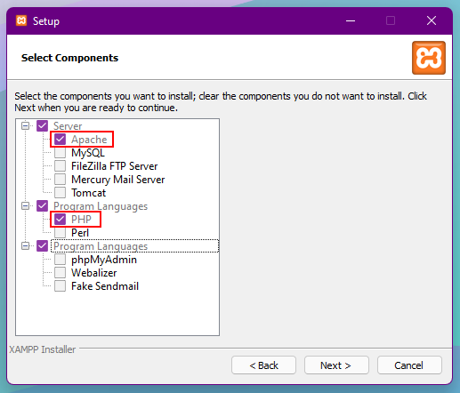

After, you have installed XAMPP, open the program called "XAMPP Control Panel" and you should see the following interface:

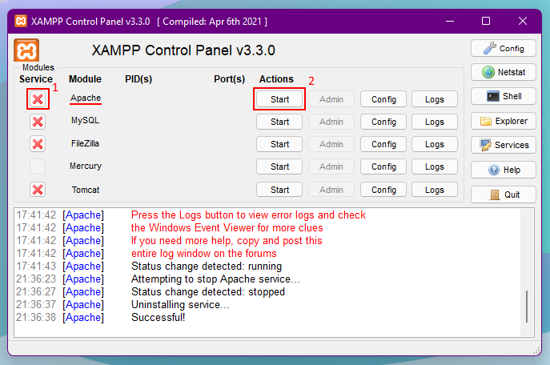

Click the buttons in the order presented in the image in order to set up the Apache Webserver component.

### ⚠️ Problem notice!! ⚠️

You may encounter issues with the Apache server not starting.

This is most likely caused by another program somewhere taking up ports 80 or 443, which are the standard HTTP ports.

The most infamous culprits are:

- **Skype**
    - Sorry, but you are shit out of luck. Complain to Microsoft, uninstall Skype, or change the Apache port. Skype used to allow changing this on older versions, but [the option is removed as of Skype 8](https://answers.microsoft.com/en-us/skype/forum/all/skype-87-change-port-80-to-other/9e61d5ec-1901-4a42-a284-db69b6644045).
- **VMware Workstation**
    - This may also occur on other VMware products, such as VMware Player.
    - If you are using **VMware 16.0** *specifically*, you will not be able to change the port. They readded the option in 16.1, although I'm not sure the update policy or if you would need to relicense it.
    - Otherwise, the port can be trivially changed in the VMware options by going to `Edit -> Preferences -> Shared VMs`, where you need to change the port to something other than 443.

[The other way to fix this is changing the Apache ports to something other than 80 and 443.](https://stackoverflow.com/a/21914920) If you do this, you will be unable to forward Rehike via hostsfile (a feature that will be supported in the future), and you will have to manually specify the port in the URL.

## Setting up Rehike

Within the XAMPP installation (default: `C:\xampp`), there should be a folder inside called `htdocs`. This contains all the PHP code to be executed when you request the server.

For a simple installation, you can simply replace the contents of this folder with the contents of a Rehike download.

To install with the Git CLI:

```
cd C:\xampp
rmdir htdocs
git clone https://github.com/Rehike/Rehike htdocs
```

### Branches!

As Rehike is in active development, certain features are only being worked on in a single dedicated branch, which will then be merged with the main one once the feature is determined to be complete enough.

The currently recommended branch is `exp-signin-rework`.

You can take a look at the branches on the GitHub website, on the left side of the main repository page. On Git CLI, you can list all branches by simply typing `git branch`.

Switching to another branch on the GitHub website just means downloading the ZIP after clicking its link. With Git CLI, you can type `git switch <branch name>`.

If you downloaded Git, you also get the fun of being able to play Frankenstein with them! (Though you may to go in and change code conflicts if they arise...)

```
git merge <other branch name>
```

Once you've gotten to this point, you can test out if Rehike works by visiting `127.0.0.1` in your web browser. If you get a YouTube page, then Rehike is working.

## Installing Fiddler

Using Rehike on `127.0.0.1` is less than ideal. Video playback won't even work out without a browser extension to disable CORS!

So the fix is to just get it onto `www.youtube.com`. This will let you play videos normally and do other cool things like log in.

Fiddler is a proxy program that allows you to do just this.

### [Download Fiddler](https://www.telerik.com/fiddler/fiddler-classic)

The installer site has some really annoying design to it that makes Fiddler seem like a paid software, but fortunately it is free.

Just enter some fake information like this on it and it will let you by no problem.

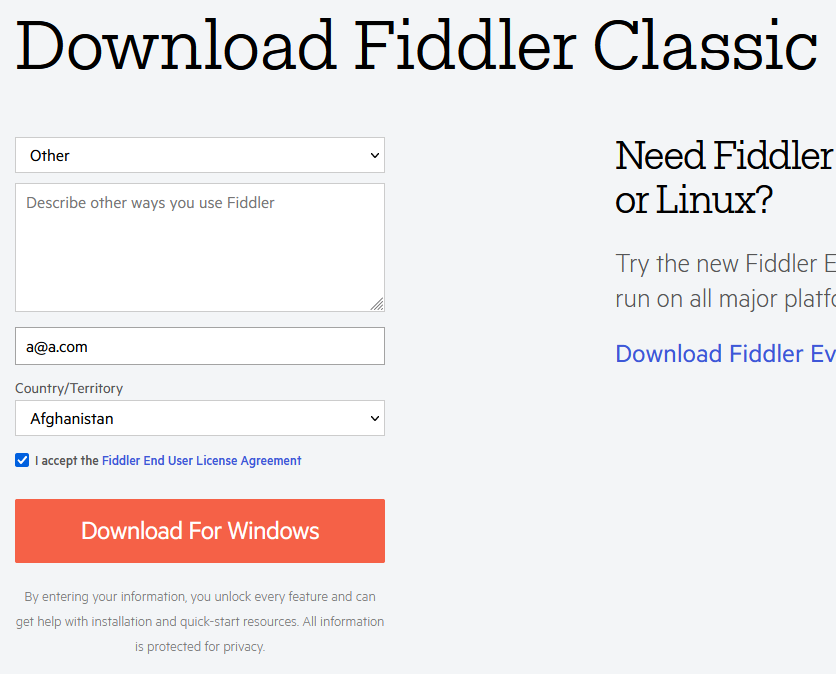

Once you have Fiddler, install it like any other program.

Then you'll get scared by seeing its UI. It is quite a mess, but Fiddler is actually fairly user-friendly for this type of software. So here are the steps you'll need to take to get everything working.

**You can ignore that initial popup you'll get when opening the program, that talks only about getting it working with UWP programs.**

You'll want to open the options panel first, and then enable SSL certificates within the program.

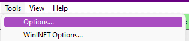

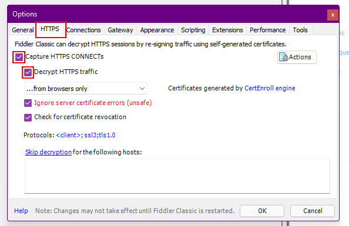

Once you're done with this step, you'll want to set up an AutoResponder rule. Set up the AutoResponder per the screenshot:

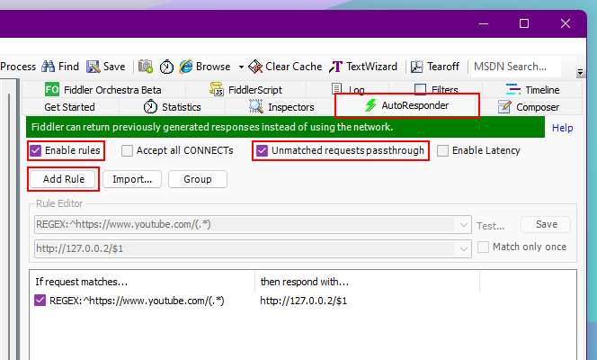

In the Rule Editor, fill out the top and bottom fields with the following, respectively:

```
REGEX:^https://www.youtube.com/(.*)
```
```
http://127.0.0.1/$1
```

Make sure to hit save!

After this task is done, you can attempt visiting `www.youtube.com`. You should see the old YouTube layout appear, but if you don't, common problems are detailed below.

### ⚠️ Problem notice!! ⚠️

If you're seeing the *new layout*, then your browser's traffic is likely not running through Fiddler at all. Try restarting your browser completely, and if the issue persists, look up details on how to proxy traffic on that browser. **This issue can also be indicative of the following issue, especially on Firefox-based browsers.**

If you see a screen like this one, mentioning a **security error** and not letting you through, then you will need to manually install an SSL certificate.

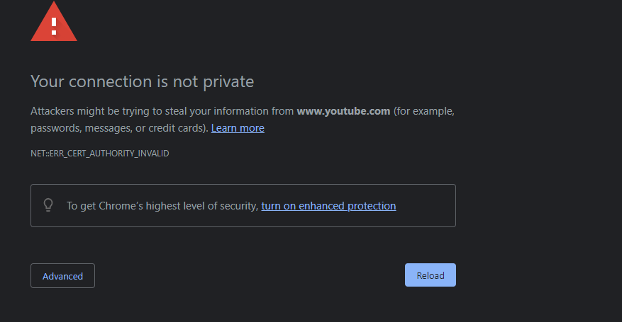

### About automatic certificate installation

Fiddler attempts to automatically install the SSL certificates in order to hijack local resolution of YouTube's domain.

For what we've observed, this seems to usually work fine for all mainline browsers: standard/ESR Firefox, and Google Chrome, specifically. It doesn't seem to be able to automatically install certificates for any other browser.

### How to manually install certificates (fixing the security error)

Firstly, you will need to open the Fiddler options (Tools -> Options) once again. Go back to the HTTPS tab and follow the instructions in the screenshot:

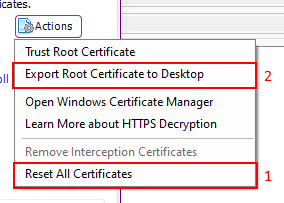

For safe measure, it's recommended that you invalidate the previous certificates used by clicking "Reset All Certificates" first. Then you want to export the certificate to your desktop in order to install it in your browser.

[Then, please read this section for more details. You'll need to in order to know how to install it into your browser, for example.](#ssl-certificate-installation)

### Optimising Fiddler & more!

When you first open Fiddler, it will use very little RAM (especially in comparison to similar programs, such as Charles). However, over time, it will grow in size to become *several gigabytes* as it will store every request it can pick up. **You probably don't want this.**

The first mitigation is to limit the number of requests stored. This can be done with a simple dropdown switch in the Fiddler GUI:

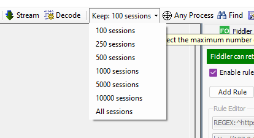

It's recommended to limit this to only 100 sessions, since you aren't using Fiddler for its intended development purposes.

**And the extreme solution:** Change Fiddler's script to keep it at a minimum at all times! In the "FiddlerScript" tab on the right pane, search for the following function and add the mentioned code:
```ts
static function OnBeforeResponse(oSession: Session) {
    if (m_Hide304s && oSession.responseCode == 304) {
        oSession["ui-hide"] = "true";
    }
    
    // Add this code to the end of the function:
    try {
        UI.actRemoveAllSessions();
    }
    catch (e) {}
}
```

And finally, if you don't want the Fiddler icon to appear in your taskbar at all times, you don't have to have it there! Just press `CTRL + M` while Fiddler is focused and it will minimise to the system tray.

## Installing mitmproxy

If you're using Linux or macOS, mitmproxy is the recommended solution. It is based on Python, so you may need to additionally install that as a prerequisite.

### [Installation instructions on their website](https://docs.mitmproxy.org/stable/overview-installation/)

For Rehike-specific use, you want to set up a script like this. Copy/paste this and replace information if needed:

```py
import mitmproxy.http
        
class RehikeMitmproxyRedirecter:
    def __init__(self):
        print("Using Rehike Redirecter.")
    
    def request(self, flow: mitmproxy.http.HTTPFlow):
        if "www.youtube.com" in flow.request.pretty_host:
            flow.request.host = "127.0.0.1"
            flow.request.port = 80
            flow.request.scheme = "http"
    
addons = [ RehikeMitmproxyRedirecter() ]
```

At least from our testing on Windows, mitmproxy is known to cause issues with some WebSocket traffic, such as uploading images to Discord chats. In order to correct this, the following launch command must be used:

```
mitmproxy -s <your redirecter script>.py --no-http2 --tcp \!\(www.youtube.com\)
```

# SSL certificate installation

This is a general guide on how to install an SSL certificate into your browser. For this section, both screenshots from Chrome and Firefox will be demonstrated, although this should generally work for other browsers too.

On Firefox, the certificate manager can be opened by a button near the bottom of the "Privacy & Security" tab at `about:preferences#privacy`.

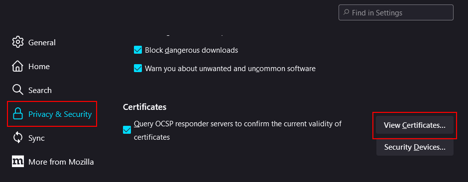

On Chrome, it appears behind two pages. First, go to the "Privacy and security" tab and find the "Security" link. Then scroll to the bottom of that and click "Manage certificates".

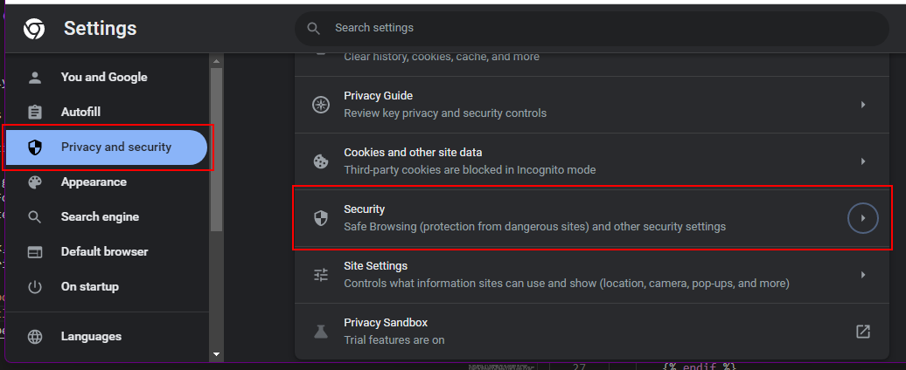

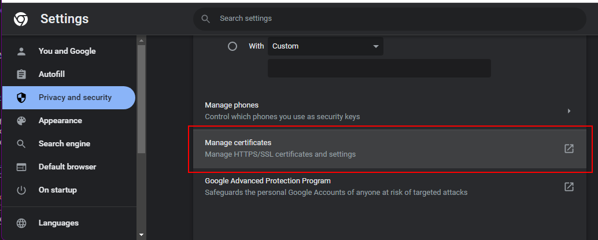

After that, you want to go to the "authorities" tab and import the SSL certificate file into there. **If it asks you what you're using it for, tick all boxes and continue.**

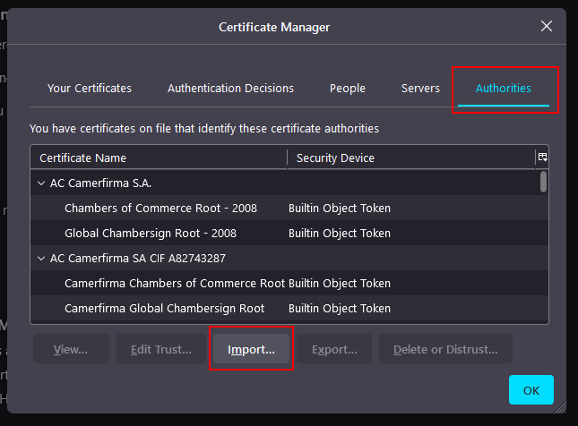
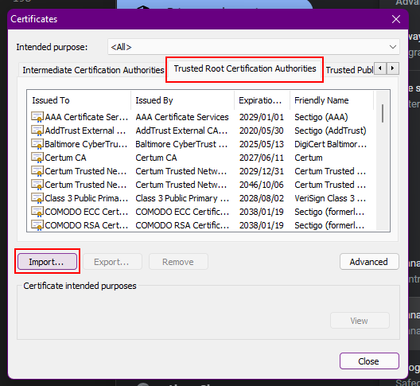
